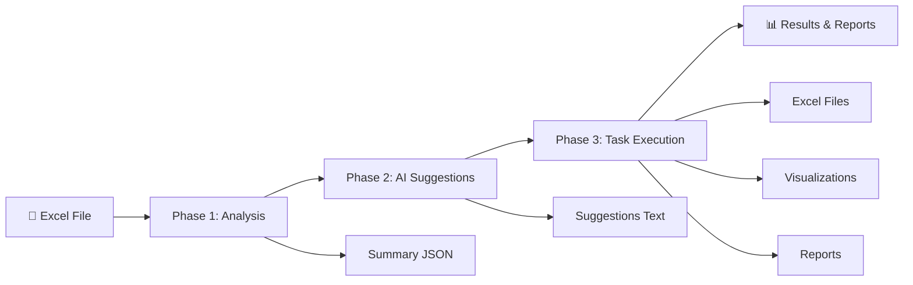

# 🤖 Excel Agent - Autonomous Excel Analyst & Automation Assistant

[](https://www.python.org/downloads/)
[]()

An intelligent AI agent that serves as your **Excel Copilot**, capable of understanding, analyzing, and automating complex Excel operations through natural language instructions.

## 🌟 Features

- 📊 **Intelligent Excel Analysis**: Automatically understands multi-sheet Excel structures
- 🤖 **AI-Powered Suggestions**: Uses Google Gemini to recommend meaningful automations
- 🗣️ **Natural Language Processing**: Execute tasks using plain English instructions
- ⚙️ **Comprehensive Operations**: Merge, filter, aggregate, pivot, visualize, and clean data
- 📈 **Automated Visualizations**: Generate insightful charts and reports
- 🎯 **Interactive Interface**: User-friendly CLI with batch execution support
- 🔄 **End-to-End Workflow**: From analysis to execution in a single pipeline

## 🏗️ Architecture

The Excel Agent follows a **3-phase architecture**:


```mermaid
graph LR
    A[📁 Excel File] --> B[Phase 1: Analysis]
    B --> C[Phase 2: AI Suggestions]
    C --> D[Phase 3: Task Execution]
    D --> E[📊 Results & Reports]

    B --> F[Summary JSON]
    C --> G[Suggestions Text]
    D --> H[Excel Files]
    D --> I[Visualizations]
    D --> J[Reports]
```

### Phase 1: Excel Analysis

- **Loader Module**: Parses Excel files and extracts metadata
- **Data Summarization**: Generates comprehensive sheet summaries
- **Sample Extraction**: Provides data samples for AI context

### Phase 2: AI Suggestion Engine

- **Gemini Integration**: Leverages Google's Gemini AI for intelligent recommendations
- **Context-Aware Suggestions**: Analyzes data patterns to suggest relevant operations
- **Custom Input Handling**: Accepts and stores user-defined tasks

### Phase 3: Task Execution Agent

- **Natural Language Parser**: Converts instructions to executable operations
- **Operation Engine**: Performs data transformations using pandas
- **Result Generation**: Creates Excel files, visualizations, and reports

## 🚀 Quick Start

### Prerequisites

- Python 3.8 or higher
- Google Gemini API key
- Excel files for analysis

### Installation

1. **Clone the repository**

   ```bash
   git clone https://github.com/yuktabande/Data-wrangler
   cd excel-agent
   ```

2. **Install dependencies**

   ```bash
   pip install -r requirements.txt
   ```

3. **Set up environment**

   ```bash
   # Create .env file
   echo "GOOGLE_API_KEY=your_gemini_api_key_here" > .env
   ```

4. **Prepare your data**

   ```bash
   # Place your Excel file in the data directory
   cp your_file.xlsx data/Input.xlsx
   ```

5. **Run the agent**
   ```bash
   python main.py
   ```

## 📁 Project Structure

```
excel-agent/
├── 📂 agent/
│   ├── __init__.py
│   ├── executor.py          # Phase 3: Task execution engine
│   ├── loader.py           # Phase 1: Excel file analysis
│   └── suggestions.py      # Phase 2: AI suggestion generation
├── 📂 data/
│   └── Input.xlsx # Your input Excel file
├── 📂 output/              # Generated results
│   ├── summary.json       # Data analysis results
│   ├── suggestions.txt    # AI recommendations
│   ├── *.xlsx            # Generated Excel files
│   └── *.png             # Visualization charts
├── 📂 tests/
│   ├── test_loader.py     # Phase 1 tests
│   ├── test_suggestions.py # Phase 2 tests
│   └── test_executor.py   # Phase 3 tests
├── 📂 utils/
│   ├── __init__.py
│   ├── file_handler.py    # File operations
│   ├── formatter.py       # Output formatting
│   └── execution_helpers.py # Additional utilities
├── config.py              # Configuration settings
├── main.py               # Main application entry point
├── requirements.txt      # Dependencies
└── README.md            # This file
```

## 🎯 Usage Examples

### Basic Workflow

```bash
$ python main.py

═══════════════════════
 Phase 1 → Analyze
═══════════════════════
📝 Loaded 3 sheets: ['Sales', 'Customers', 'Returns']
📝 Saved summary → output/summary.json

═══════════════════════
 Phase 2 → AI Suggestions
═══════════════════════
🔍 AI Suggested Automations:

1. Join Sales & Returns on Order_ID for comprehensive analysis
2. Aggregate Sales by Product_Category to show revenue breakdown
3. Create visualization showing sales trends over time
4. Clean missing values and remove duplicate entries
5. Filter customers by region for targeted analysis

💾 Saved suggestions → output/suggestions.txt

═══════════════════════
 Phase 3 → Task Execution
═══════════════════════
🚀 Ready to execute tasks! Choose an option:

📋 AI Suggested Actions:
   1. Join Sales & Returns on Order_ID for comprehensive analysis
   2. Aggregate Sales by Product_Category to show revenue breakdown
   3. Create visualization showing sales trends over time
   4. Clean missing values and remove duplicate entries
   5. Filter customers by region for targeted analysis

📝 Custom Options:
   6. Enter custom instruction
   7. Execute multiple tasks
   0. Exit

🎯 Choose an option (0-7): 6

💭 Enter your custom instruction:
Instruction: merge sales and customers, then show total revenue by city for 2024

⚙️ Executing: merge sales and customers, then show total revenue by city for 2024
──────────────────────────────────────────────────────────

🧠 Parsed Instruction:
   Action: merge
   Sheets: ['Sales', 'Customers']
   Columns: ['Customer_ID']

📊 Execution Results:
   ✅ Merged Sales and Customers on 'Customer_ID'
   📁 Output saved: output/merged_Sales_Customers.xlsx
   📏 Result shape: (1,250 rows × 15 columns)
```

### Supported Operations

| Operation     | Example Commands                       | Output              |
| ------------- | -------------------------------------- | ------------------- |
| **Merge**     | "join Sales and Returns on Order ID"   | Combined Excel file |
| **Aggregate** | "show total sales by product category" | Summary table       |
| **Filter**    | "remove rows with missing values"      | Cleaned dataset     |
| **Visualize** | "create charts for sales trends"       | PNG charts          |
| **Pivot**     | "pivot sales by month and product"     | Pivot table         |
| **Clean**     | "clean data and remove outliers"       | Processed dataset   |
| **Summary**   | "generate detailed data summary"       | JSON report         |

### Natural Language Examples

```bash
# Data Joining
"merge Sales with Customer data on Customer_ID"
"join all tables using common ID column"

# Analysis
"show me total revenue by product category"
"calculate average order value by customer segment"
"group sales data by month and sum quantities"

# Data Quality
"clean the data and remove duplicates"
"filter out orders where quantity is zero"
"remove outliers from the price column"

# Visualizations
"create charts showing sales trends"
"visualize correlation between price and quantity"
"show distribution of customer demographics"
```

## 🔧 Advanced Features

### Batch Execution

Execute multiple tasks in sequence:

```bash
Tasks to execute: 1,3,5,7
# or execute all suggestions
Tasks to execute: all
```

### Custom Data Processing

The agent can handle complex multi-step operations:

```bash
"First merge Sales with Customers, then group by City,
 calculate total revenue, and create a bar chart"
```

### Data Quality Assessment

Automatic detection of:

- ✅ Missing values (>10% threshold)
- ✅ Duplicate rows
- ✅ Statistical outliers
- ✅ Data type inconsistencies
- ✅ Structural issues

### Smart Fallbacks

- **LLM Parsing**: Primary method using Gemini AI
- **Rule-Based Parsing**: Fallback for reliability
- **Error Recovery**: Graceful handling of edge cases

## 📊 Sample Outputs

### Generated Visualizations

The agent creates comprehensive visual analyses:

- 📈 **Distribution plots** for numeric data
- 🔗 **Correlation heatmaps** for relationships
- 📊 **Bar charts** for categorical analysis
- 🎯 **Scatter plots** for trend identification

### Excel Outputs

Processed files include:

- **Merged datasets** with intelligent column handling
- **Aggregated summaries** with statistical insights
- **Cleaned data** with quality improvements
- **Pivot tables** for multi-dimensional analysis

### JSON Reports

Detailed summaries containing:

```json
{
  "sheet_name": "Sales",
  "shape": [1000, 8],
  "columns": ["Order_ID", "Product", "Quantity", "Price"],
  "data_quality": {
    "missing_values": { "Product": 5, "Price": 2 },
    "duplicates": 12,
    "outliers": { "Price": 8 }
  },
  "recommendations": [
    "Clean missing values in Product column",
    "Remove 12 duplicate entries",
    "Review price outliers"
  ]
}
```

## 🧪 Testing

### Run Test Suite

```bash
# Run all tests
pytest tests/

# Run specific phase tests
python tests/test_loader.py      # Phase 1
python tests/test_suggestions.py # Phase 2
python tests/test_executor.py    # Phase 3
```

### Generate Test Data

```python
from tests.test_executor import create_test_data
test_file = create_test_data()
```

### Manual Testing

```bash
# Create comprehensive test dataset
python tests/test_executor.py
```

## 🔍 Troubleshooting

### Common Issues

**API Key Issues**

```bash
# Error: "GOOGLE_API_KEY not found"
echo "GOOGLE_API_KEY=your_actual_key" > .env
```

**File Path Issues**

```bash
# Error: "Input file not found"
# Ensure your file is at: excel-agent/data/input.xlsx
```

**Memory Issues**

```bash
# For large files, increase available memory or process in chunks
# Consider splitting large datasets into smaller files
```

**Parsing Failures**

```bash
# Enable debug mode
export PYTHONPATH=$PYTHONPATH:$(pwd)
python -m pdb main.py
```

### Debug Mode

Enable detailed logging:

```python
# In config.py
import logging
logging.basicConfig(level=logging.DEBUG)
```

## 📈 Performance

### Benchmarks

- **Small files** (<1MB): ~5-10 seconds end-to-end
- **Medium files** (1-10MB): ~15-30 seconds
- **Large files** (10-50MB): ~45-90 seconds

### Optimization Tips

- Use batch execution for multiple operations
- Pre-clean data to reduce processing time
- Leverage caching for repeated operations
- Monitor memory usage with large datasets

## 🔐 Security & Privacy

- **Local Processing**: All data remains on your machine
- **API Security**: Gemini API calls use secure HTTPS
- **No Data Storage**: No persistent data storage in cloud
- **Configurable Limits**: Set processing limits for safety

## 🚀 Future Roadmap

### Planned Features

- 🔄 **Scheduled Automation**: Run tasks on data updates
- 🤖 **Advanced ML**: Predictive analytics and anomaly detection
- 🌐 **Web Interface**: Browser-based dashboard
- 📱 **API Endpoints**: RESTful API for integration
- 🔗 **Database Support**: Connect to SQL databases
- 📧 **Report Automation**: Email generated reports

### Version History

- **v1.0**: Core analysis and suggestion engine
- **v1.1**: Task execution and natural language processing
- **v1.2**: Enhanced visualizations and batch processing
- **v2.0** (Planned): Web interface and advanced analytics

## 🤝 Contributing

We welcome contributions! Please see our contributing guidelines:

### Development Setup

```bash
# Fork and clone
git clone https://github.com/yuktabande/Data-wrangler
cd excel-agent

# Create development branch
git checkout -b feature/your-feature-name

# Install development dependencies
pip install -r requirements-dev.txt

# Run tests before committing
pytest tests/
```

### Contribution Areas

- 🐛 **Bug Fixes**: Report and fix issues
- ✨ **New Features**: Add operation types
- 📚 **Documentation**: Improve guides and examples
- 🧪 **Testing**: Increase test coverage
- 🎨 **UI/UX**: Enhance user experience

## 🙏 Acknowledgments

- **Google Gemini**: AI-powered suggestion engine
- **Pandas**: Core data processing library
- **OpenPyXL**: Excel file handling
- **Matplotlib/Seaborn**: Visualization capabilities
- **Community Contributors**: Thank you for your contributions!

## 📞 Support

- 📧 **Email**: [yuktaabande@gmail.com]
- 💬 **Issues**: [GitHub Issues](https://github.com/yuktabande/excel-agent/issues)
- 📖 **Documentation**: [Wiki](https://github.com/yuktabande/excel-agent/wiki)
- 🎯 **Discussions**: [GitHub Discussions](https://github.com/yuktabande/excel-agent/discussions)

---

<div align="center">

**Built with ❤️ for data analysts and Excel power users**

[⭐ Star this repository](https://github.com/yuktabande/excel-agent) | [🐛 Report Bug](https://github.com/yuktabande/excel-agent/issues) | [💡 Request Feature](https://github.com/yuktabande/excel-agent/issues)

</div>
